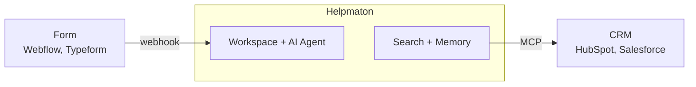

If you've ever worked in B2B sales, you've felt it: the **"Cold Lead Silence."** Someone fills out a form on your website. Your inbox pings. You open it and see a name, an email, and maybe a line like *"I'd like to learn more."* That's it. No company size, no role, no hint of what they actually need.

So what happens next? Usually, your rep has to play detective. They jump on LinkedIn, Google the company, skim recent news, and dig through the CRM to see if anyone else from that domain has ever reached out. That's easily 15 minutes of legwork—and by the time they're ready to send a thoughtful follow-up, the lead has often already gone cold.

**There's a better way.** What if that form submission could instantly trigger an AI that researches the company, checks your existing history with them, and drops a ready-to-use summary straight into your CRM? That's exactly what **Helpmaton** does. It sits between your website forms and your CRM (HubSpot, Salesforce, or others) as an intelligent "brain"—so you're not just moving data, you're closing the loop and turning every new lead into actionable sales intelligence in seconds.

---

### How It Works: Form → Helpmaton → CRM

Most automation tools are basically dumb pipes. They take data from A and drop it at B. Helpmaton is different: it adds a **reasoning layer**. The data gets understood, enriched, and then sent on—so your team gets context, not just a new row in a spreadsheet.

Here's how the closed-loop workflow works, step by step.

#### 1. The trigger: inbound webhooks

The moment a lead clicks "Submit" on your Webflow site, your Typeform, or your custom landing page, a webhook fires that data into a **Helpmaton Workspace**. No manual copy-paste, no CSV uploads.

That webhook doesn't just land in a bucket. It wakes up an **AI Agent**—think of it as your *Lead Qualification Assistant*. The agent doesn't just "receive" the data; it starts working on it right away.

#### 2. The processing: enrichment and memory

Once the lead data is in the Workspace, the agent gets to work with two powerful tools:

* **Advanced search and content extraction.** Helpmaton's advanced search can look up companies, people, and more—so the agent can pull exactly the right kind of intel. It takes the lead's company domain (or the person) and runs a real-time search. Within seconds it can surface recent press releases, product launches, job postings, or other signals that matter for your pitch.
* **Agent memory.** Helpmaton also checks its own memory. Has this company talked to your agents before? Did someone from that domain ask a technical question in your Slack community a few months ago? The agent connects those dots and adds that context—stuff a normal CRM record would never show you.

So by the time the agent is done, you don't just have "John from Acme Corp." You have a short dossier: who they are, what's going on at their company, and how they've already interacted with you.

#### 3. The action: CRM integration via MCP

Instead of dumping a bare "New Lead" into your CRM, Helpmaton uses the **Model Context Protocol (MCP)** to talk directly to HubSpot or Salesforce. So the agent can actually *do* something with what it learned.

For example, it can:

* **Score the lead** using your own criteria (your Ideal Customer Profile, or ICP, defined in the agent's instructions).
* **Draft the "first touch"** for your rep—a short, personalized brief. Something like: *"High-priority lead. They just expanded their engineering team (from web search) and previously downloaded our whitepaper (from memory). Focus the pitch on scalability."*
* **Update the record** by writing that summary and the research straight into the CRM notes. When your rep opens the task, everything they need is already there.

No more tab-switching. No more "I'll research this and get back to you." The loop is closed before the rep even picks up the lead.

---

### Why use Helpmaton instead of building it yourself?

You could try to wire this up with a bunch of generic tools and a lot of custom code. But for most growth teams, that's a time sink and a maintenance headache. Helpmaton gives you three things that are hard to get right on your own:

#### Quality you can measure (Judge Evals)

How do you know your AI isn't making up lead scores or missing obvious red flags? Helpmaton's **Judge Evals** feature automatically reviews your agent's conversations and outputs. You define rules (e.g. "never score without checking company size") and the system checks that the AI stays consistent. Problems get caught before they ever reach your CRM.

#### Predictable spend (budget control)

When you're processing hundreds of leads, API costs can spiral fast. Helpmaton lets you set **daily, monthly, or yearly budget limits** per agent. You still get the power of models like GPT-4o or Claude 3.5—without the surprise bill at the end of the month.

#### Workspaces for security and clarity

With a dedicated **Workspace** for lead gen, you keep sensitive sales data in one place and control who on your team can see the agent's logic and history. No more shared scripts or one-size-fits-all pipelines; you can tune this workflow for your team and your ICP.

---

### From "static record" to "strategic insight"

The point of sales automation isn't just speed. It's **readiness**. You want your team to act on every lead with the right context, not with a blank slate.

When you connect your website forms to Helpmaton, you're not just moving data—you're giving your sales team a head start. Every new notification comes with a strategy: who this is, why they might be a fit, and how to approach them. That's the loop closed.

**Stop juggling raw leads. Start closing the loop.**

*Ready to turn your website forms into an intelligent sales engine? [Explore Helpmaton Workspaces](https://helpmaton.com) and start your free trial today.*

